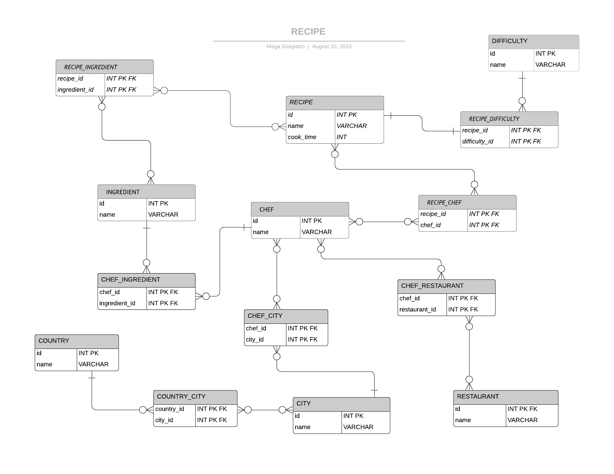

Imagine you are creating a food website that will have recipes by top chefs from around the world. The following data will be required:
- recipe name
- number of ingredients
- ingredients
- difficulty level
- cook time
- chef (who wrote the recipe)
- country (where the chef lives)
- city (where the chef lives)
- restaurants where the chef has worked
- chef's favorite ingredient

