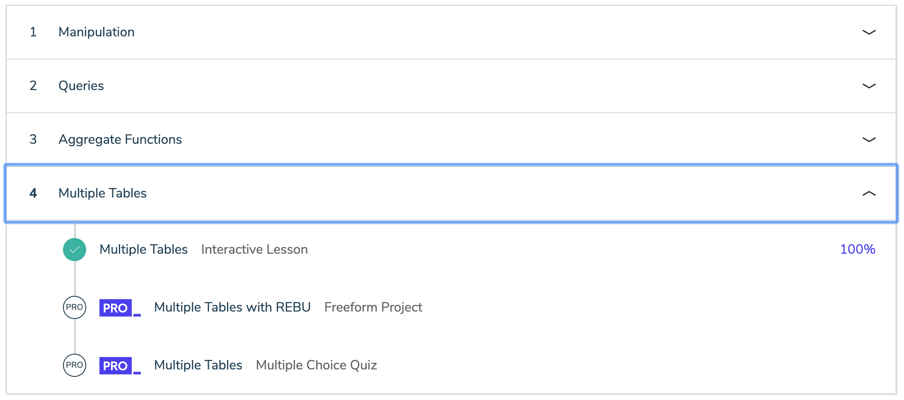

## Codecademy screenshot

## Independent Practice

### made for [this](https://github.com/Techtonica/curriculum/blob/master/databases/sql-2.md) assigment

-- create table USERS and POSTS
CREATE TABLE users (
id INTEGER PRIMARY KEY,
name TEXT,
email TEXT
);

-- create table POSTS
-- field USER_ID is a foreign key
CREATE TABLE posts (
id INTEGER PRIMARY KEY,
user_id INTEGER NOT NULL,
content TEXT NOT NULL,
date INTEGER NOT NULL,
FOREIGN KEY(user_id) REFERENCES users(id)
);

-- start inserting values into tables
INSERT INTO users
VALUES (1, 'mega', 'megaemail@gmail.com');

INSERT INTO users
VALUES (2, 'alicia', 'aliciaemail@gmail.com');

INSERT INTO users
VALUES (3, 'jen', 'jenemail@gmail.com');

INSERT INTO posts
VALUES (1, 1, 'this is a blogpost with id 1 and user_id 1', strftime('%s','2019-01-01 10:00:00.000'));

INSERT INTO posts
VALUES (2, 1, 'this is a blogpost with id 2 and user_id 1', strftime('%s','2019-02-01 21:00:00.000'));

INSERT INTO posts
VALUES (3, 1, 'this is a blogpost with id 3 and user_id 1', strftime('%s','2019-03-01 16:00:00.000'));

INSERT INTO posts
VALUES (4, 2, 'this is a blogpost with id 4 and user_id 2', strftime('%s','2019-07-28 21:00:00.000'));

INSERT INTO posts
VALUES (5, 3, 'this is a blogpost with id 5 and user_id 3', strftime('%s','now'));
-- end inserting values into tables

-- query all the tweets by a given user
SELECT * FROM posts WHERE user_id=1;

-- query the 10 most recent tweets by any user
SELECT * 
FROM posts 
WHERE user_id=1
ORDER BY date DESC
LIMIT 10;

-- use a join to get a user's info along with their tweets
SELECT *
FROM users
JOIN posts ON users.id = posts.user_id;

-- get user's name and posts count only if the count greater than 2
SELECT users.name, count(posts.content) as post_count
FROM users
JOIN posts ON users.id = posts.user_id
GROUP BY users.id
HAVING post_count > 2;

-- add a text field named: bio to your existing users table
ALTER TABLE users ADD COLUMN bio TEXT;

-- add some sample data to your new bio fields, but not for every user
UPDATE users 
SET bio = 'user is an apprentice at tectonic'a
WHERE id = 1;

-- query just the bios of all users in the databases
SELECT bio FROM users;

-- query a list of users that have no bio
SELECT * FROM users WHERE bio IS NULL;

-- query just the names of those users that have no bio
SELECT name FROM users WHERE bio IS NULL;

-- query user's name, posts, and the date of those posts if the user's bio is not empty
SELECT users.name, posts.content, datetime(date, 'unixepoch') AS post_date
FROM users
JOIN posts ON users.id = posts.user_id
WHERE users.bio IS NOT NULL;

-- add a new table named follows that has an int field follower_id and an int field followed_id
CREATE TABLE follows (
follower_id INTEGER NOT NULL,
followed_id INTEGER NOT NULL
);

INSERT INTO follows VALUES(1,2);
INSERT INTO follows VALUES(3,2);
INSERT INTO follows VALUES(3,1);
INSERT INTO follows VALUES(2,3);

-- query all users that user 2 is following
SELECT users.* 
FROM users
JOIN follows on users.id = follows.followed_id
WHERE follows.follower_id = 2;

-- query all users that follow user 2
SELECT users.* 
FROM users
JOIN follows on users.id = follows.follower_id
WHERE follows.followed_id = 2;

-- find which user has the most followers
WITH temporary_users AS (
   SELECT users.name , count(follows.follower_id) as follower_count
  FROM users
  JOIN follows on users.id = follows.followed_id
  GROUP BY follows.follower_id
)
SELECT temporary_users.name, max(temporary_users.follower_count)
FROM temporary_users;
