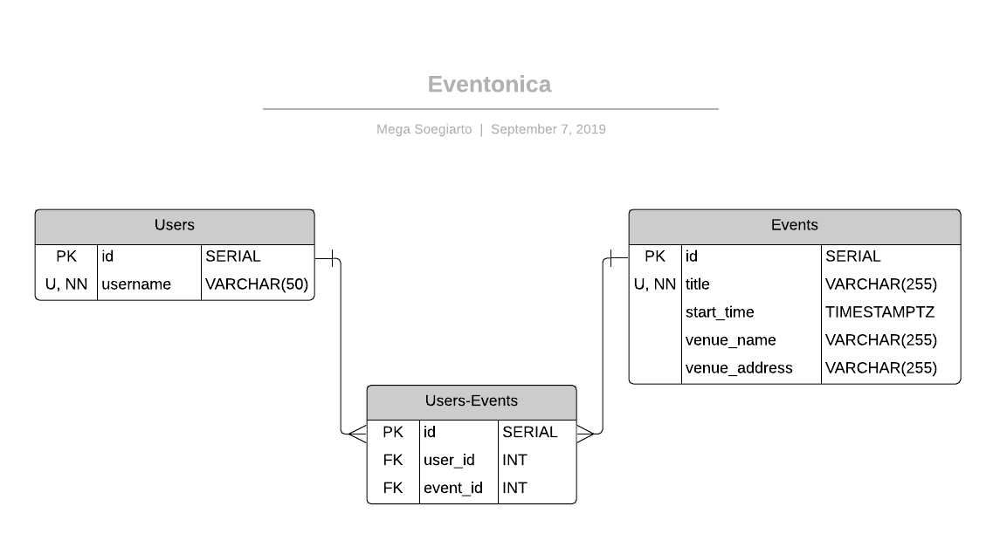

# Eventful API with Express

API client made for [this](https://github.com/Techtonica/curriculum/blob/master/projects/eventonica-project.md) assignment

## Build with 

[express](https://expressjs.com/)

[pg](https://node-postgres.com/)

[eventful-node](http://api.eventful.com/)

[dotenv](https://github.com/motdotla/dotenv)

## ERD

## Endpoint

1. `GET /users` display all users

2. `GET /users/:id` display a single user

3. `POST /users` create a user

   parameter = username

       {
         "username": "example"
       }

4. `GET /events` display all events

5. `GET /events/:id` display a single event

6. `GET /events/search/:keywords` search event

7. `POST /events` save an event

   parameter = title, start_time, venue_name, venue_address

       {
         "title": "example event title",
         "start_time": "2019-01-01 07:00:00.000",
         "venue_name": "example venue name",
         "venue_address": "example venue address"
       }

8. `POST /userevents` match a user with an event

   parameter = username, title

       {
         "username": "example",
         "title": "example event title"
       }

9. `GET /users/:id/events` display a single user's saved events

10. `GET /events/:id/users` display a single event's attendees
