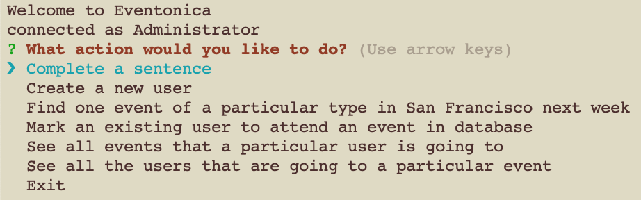
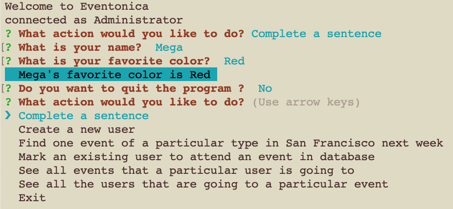
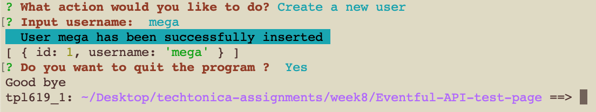
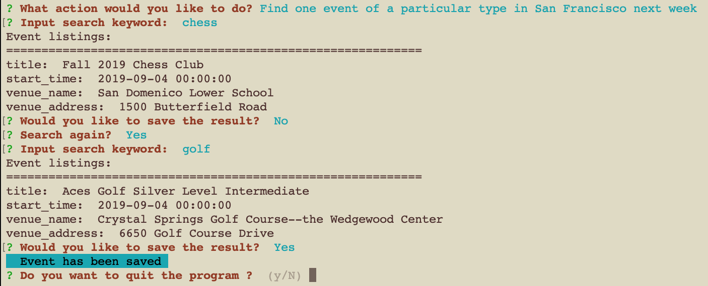
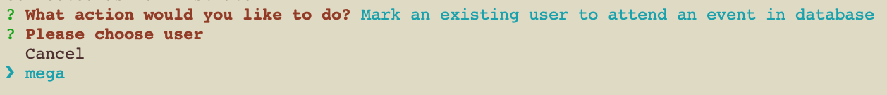
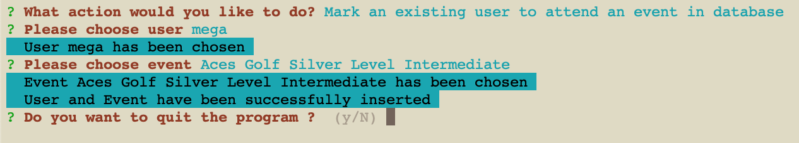
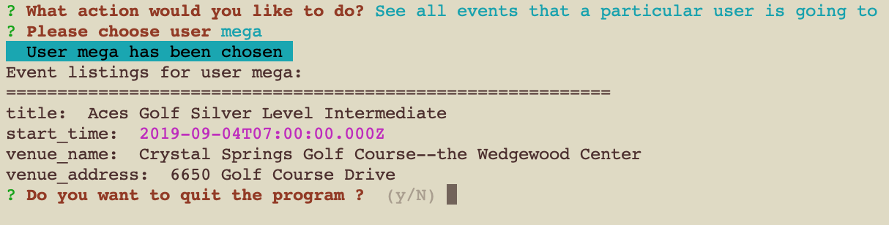
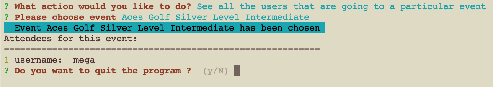
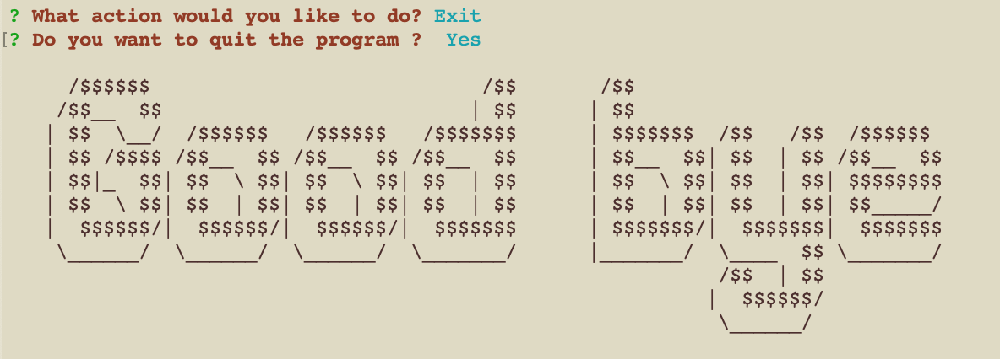

# Eventful API test page

made for [this](https://github.com/Techtonica/curriculum/blob/master/projects/eventonica-project.md) assignment

## Setup PostgreSQL database

Create a database called `eventonica`

Create a user called `eventonica`

Create a table called `"Users"`

    CREATE TABLE "Users" (
      id SERIAL PRIMARY KEY,
      username VARCHAR(50) UNIQUE NOT NULL
    );

Create a table called `"Events"`

    CREATE TABLE "Events" (
      id SERIAL PRIMARY KEY,
      title VARCHAR(255) UNIQUE NOT NULL,
      start_time TIMESTAMPTZ,
      venue_name VARCHAR(255),
      venue_address VARCHAR(255)
    );

Create a table called `"Users-Events"`

    CREATE TABLE "Users-Events" (
      id SERIAL PRIMARY KEY,
      user_id INT REFERENCES "Users" (id) ON DELETE SET NULL
      event_id INT REFERENCES "Events" (id) ON DELETE SET NULL,
    );

## Main menu

   There are 7 options to choose:

   a. Complete a sentence

   b. Create a new user

   c. Find one event of a particular type in San Francisco next week

   d. Mark an existing user to attend an event in database

   e. See all events that a particular user is going to

   f. See all the users that are going to a particular event

   g. Exit

   

## The program

1. Complete a sentence

   Two questions will be asked

   a. What is your name?

   b. What is your favorite color?

   The result will be printed out as `<name>'s favorite color is <color>`

   The program will ask if user wants to quit the program. Choose 'y' to quit or 'n' to go back to the main menu.

   

2. Create a new user

   User will be asked to enter a username.

   The program will then insert the username into `eventonica` database and print out the list of users.

   The program will ask if user wants to quit the program. Enter 'y' to quit or 'n' to go back to the main menu.

   

3. Find one event of a particular type in San Francisco next week

   User will be asked to enter a keyword

   Program will show an event of the entered keyword and ask user if the user wants to save the event. Enter 'y' to save the event into `"Events"` table. Enter 'n' and the program will prompt the user to search again.

   

4. Mark an existing user to attend an event in database

   The program will display the usernames stored in the `"Users"` database and prompt user to choose one user from the list.

   

   Then the program will display the events stored in the `"Events"` database and prompt user to choose one event from the list.

   The program will ask if user wants to quit the program. Enter 'y' to quit or 'n' to go back to the main menu.

   

5. See all events that a particular user is going to

   The program will display the usernames stored in the `"Users"` database and prompt user to choose one user from the list. Then a list of user's saved events will be displayed.

   

6. See all the users that are going to a particular event

   Then the program will display the events stored in the `"Events"` database and prompt user to choose one event from the list. Then a list of attendees will be displayed.

   

7. Exit

   The program will ask if user wants to quit the program. Enter 'y' to quit or 'n' to go back to the main menu.

   

## Build with

[pg](https://node-postgres.com/)

[inquirer](https://github.com/SBoudrias/Inquirer.js/)

[eventful-node](http://api.eventful.com/)

#### Author

Mega
