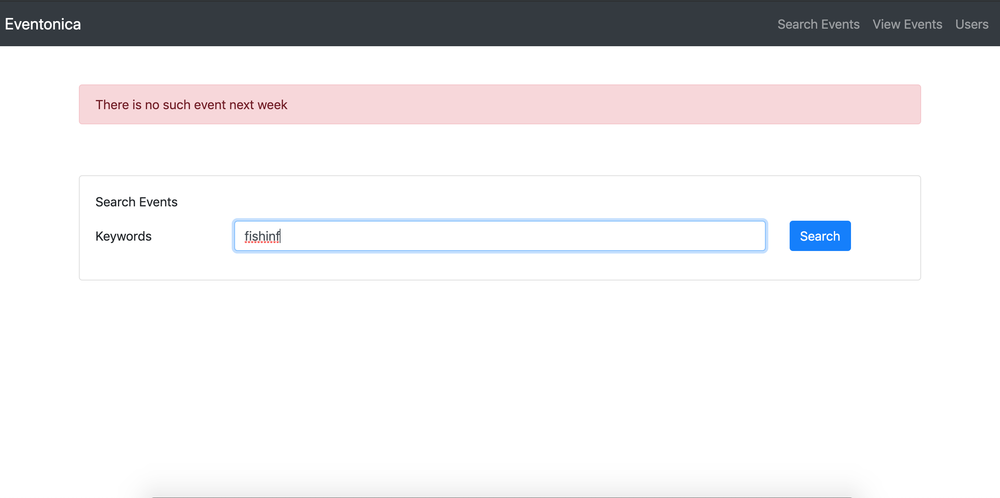
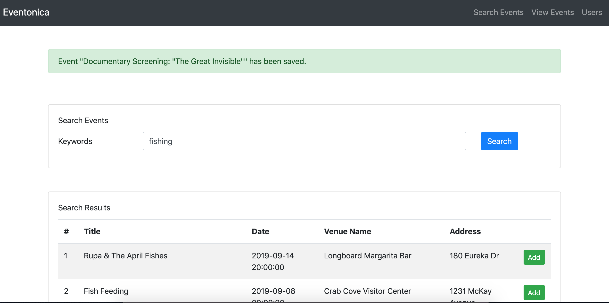
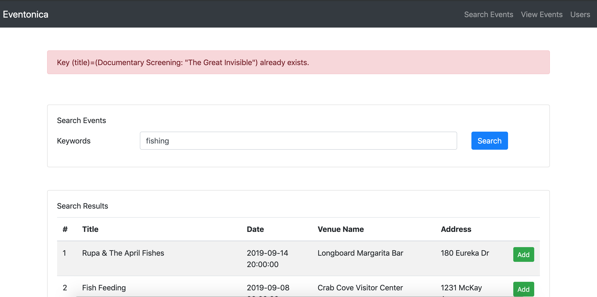
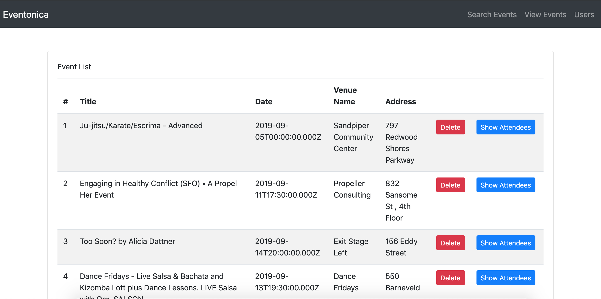
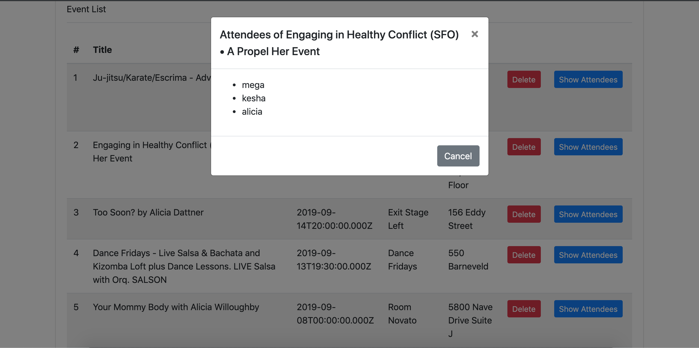
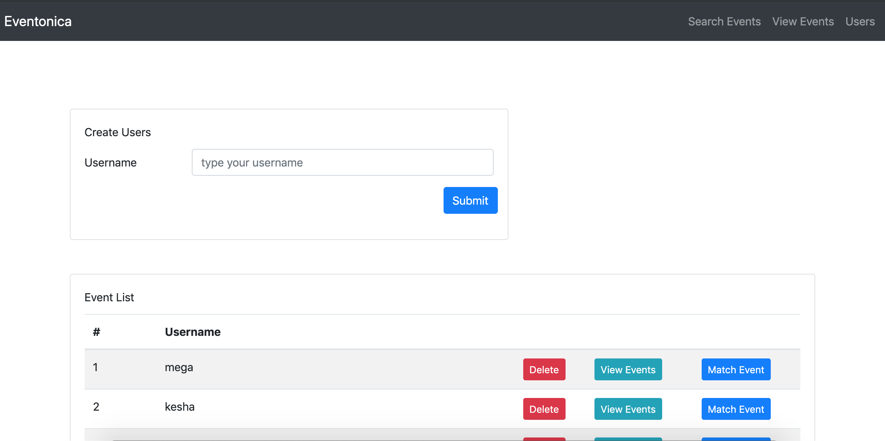
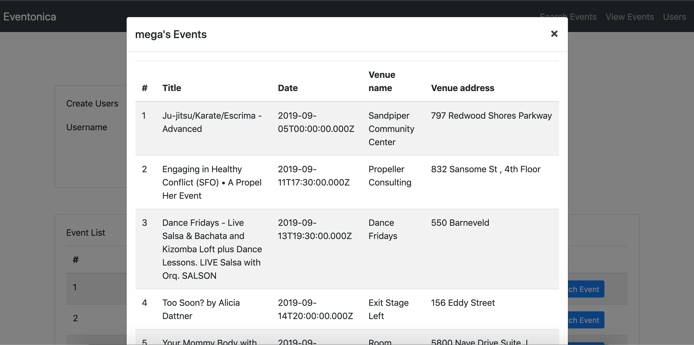
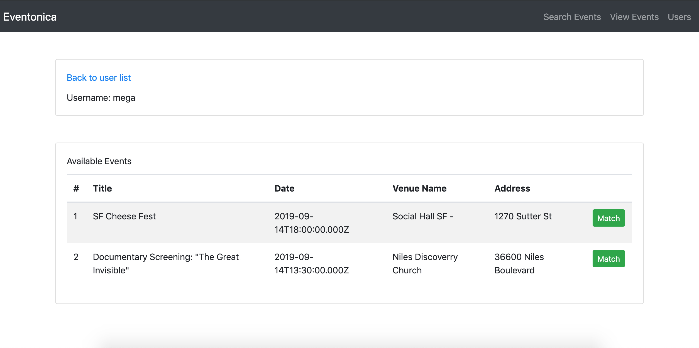
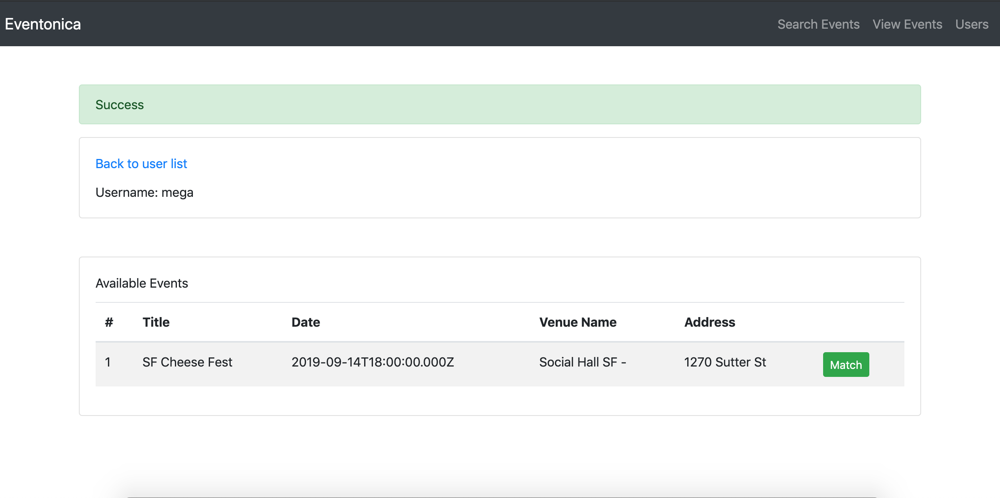

# Eventonica React

made for [eventonica-react](https://github.com/Techtonica/curriculum/blob/master/projects/eventonica-react.md) assignment and [react assessment](https://github.com/Techtonica/curriculum/blob/master/projects/react-assessment.md) 

click here for [live](https://msoegiarto-eventonica.herokuapp.com) site

# Build with

[ElephantSQL](https://www.elephantsql.com/)

[express](https://expressjs.com/)

[pg](https://node-postgres.com/)

[eventful-node](http://api.eventful.com/)

[dotenv](https://github.com/motdotla/dotenv)

[react](https://reactjs.org/)

[bootstrap](https://getbootstrap.com/)

[reactstrap](https://reactstrap.github.io/)

[axios](https://github.com/axios/axios)

# ERD

# Install

1. Fork and clone the repo

2. Go to the `eventonica-react` folder

2. Install dependencies by running `npm install` and `npm run client-install`

3. Create a file called `.env`. It should contain:

        PGHOST=<your_db_host>
        PGPORT=<your_db_port>
        PGNAME=<your_db_name>
        PGUSER=<your_db_user>
        PGPASS=<your_db_password>
        EVENTFUL_API_KEY=<your_eventful_api_key>

4. Database (PostgresSQL)

   Create a table called `"Users"`, `"Events"` and `"Users-Events"`

        CREATE TABLE "Users" (
            id SERIAL PRIMARY KEY,
            username VARCHAR(50) UNIQUE NOT NULL
        );

        CREATE TABLE "Events" (
            id SERIAL PRIMARY KEY,
            title VARCHAR(255) UNIQUE NOT NULL,
            start_time TIMESTAMPTZ,
            venue_name VARCHAR(255),
            venue_address VARCHAR(255)
        );

        CREATE TABLE "Users-Events" (
            id SERIAL PRIMARY KEY,
            user_id INT REFERENCES "Users" (id) ON DELETE SET NULL,
            event_id INT REFERENCES "Events" (id) ON DELETE SET NULL
        );

5. Start the application locally

   Run `npm run server` to start only the server at `localhost:5000`

   Run `npm run client` to start only the client at `localhost:3000`

   Run `npm run dev` to run both concurrently

# Screenshots

1. Home (Search events page)

    

2. Search Events

    

3. Search Events (not found)

    

4. Save event

    

5. Save event (duplicate error)

    

6. View and/or delete saved events

    

7. View an event's attendees

    

8. Create, view or delete users 

    

9. View a user's events

    

10. Match user-event page

    

11. Match a user with an event

    

### Author

__Mega__
