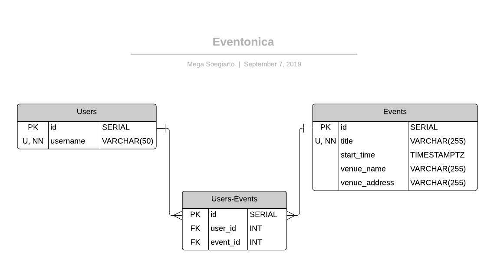
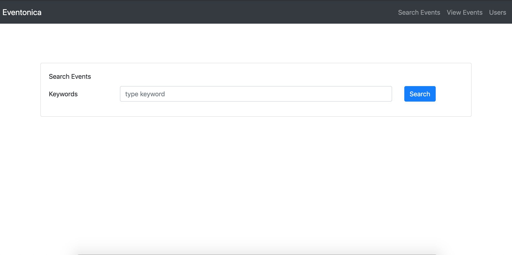

# Eventonica React

made for [eventonica-react](https://github.com/Techtonica/curriculum/blob/master/projects/eventonica-react.md) assignment and [react assessment](https://github.com/Techtonica/curriculum/blob/master/projects/react-assessment.md) 

# Build with

[ElephantSQL](https://www.elephantsql.com/)

[express](https://expressjs.com/)

[pg](https://node-postgres.com/)

[eventful-node](http://api.eventful.com/)

[dotenv](https://github.com/motdotla/dotenv)

[react](https://reactjs.org/)

[bootstrap](https://getbootstrap.com/)

[reactstrap](https://reactstrap.github.io/)

[axios](https://github.com/axios/axios)

# ERD

# Screenshots

1. Home (Search events page)

    

2. Search Events

    

3. Search Events (not found)

    

4. Save event

    

5. Save event (duplicate error)

    

6. View and/or delete saved events

    

7. View an event's attendees

    

8. Create, view or delete users 

    

9. View a user's events

    

10. Match user-event page

    

11. Match a user with an event

    

### Author

__Mega__